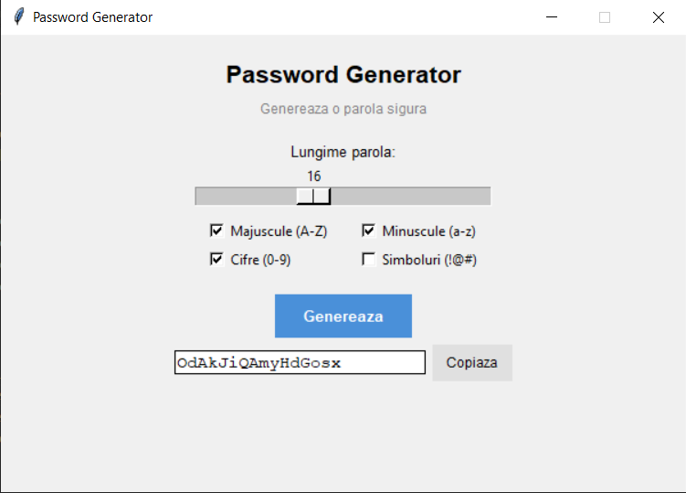

# 🔐 Password Generator


> A desktop application for generating secure, customizable passwords — built with Python and Tkinter using Object-Oriented Programming principles.

---

## 📸 Preview



---

## ✨ Features

- 🔡 **Custom Length** — choose exactly how long your password should be
- 🔠 **Character Set Control** — toggle Uppercase, Lowercase, Digits, and Symbols independently
- 📋 **Copy to Clipboard** — one-click copy, ready to paste anywhere
- 🖥️ **Graphical Interface** — clean, intuitive GUI built with Tkinter (no terminal needed)

---

## 🏗️ Project Structure

```
password-generator/
│
├── password_generator.py   # Main application file
├── README.md               # Project documentation
└── .gitignore
```

---

## 🧠 Object-Oriented Design

This project applies **OOP principles** to keep the code clean, modular, and easy to extend.

The core logic is encapsulated inside a `PasswordGenerator` class, separating concerns between:

| Responsibility | Description |
|---|---|
| **Data / State** | Stores user preferences (length, character options) as class attributes |
| **Logic** | Methods handle password generation, validation, and clipboard interaction |
| **UI** | The GUI is built and managed through the class, keeping everything in one place |

**Key OOP concepts applied:**
- **Encapsulation** — password settings are stored and managed within the class
- **Methods** — each action (generate, copy, validate) is a separate, reusable method
- **Single Responsibility** — class handles one thing: password generation logic + its interface

---

## 🚀 Getting Started

### Prerequisites

Make sure you have Python 3 installed:
```bash
python --version
```

Tkinter comes built-in with Python. No extra installs needed!

### Run the App

```bash
# Clone the repository
git clone https://github.com/marioteodor18/password-generator.git

# Navigate into the folder
cd password-generator

# Run the app
python "password_generator (2).py"
```

---

## 🎯 How It Works

1. **Set your password length** using the input field
2. **Select character types** — check/uncheck Uppercase, Lowercase, Numbers, Symbols
3. **Click Generate** — a secure random password is created instantly
4. **Click Copy** — password is copied to your clipboard, ready to use

---

## 📚 What I Learned

This project is part of my Python learning journey. Through building it, I practiced:

- Applying **OOP** concepts in a real-world project
- Building desktop **GUIs with Tkinter**
- Working with Python's `random` and `string` modules
- Structuring a project with clean, readable code

---

## 🗺️ Future Improvements

- [ ] Password strength indicator
- [ ] Save generated passwords to a file
- [ ] Dark mode UI
- [ ] Password history log

---

## 👤 Author

**Roman Mario**  
📌 GitHub: [@marioteodor18](https://github.com/marioteodor18)

---

## 📄 License

This project is open source and available under the [MIT License](LICENSE).
